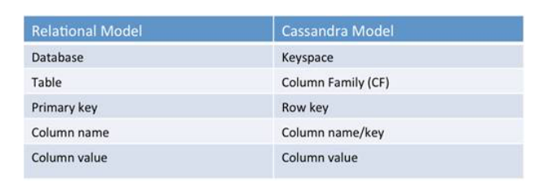
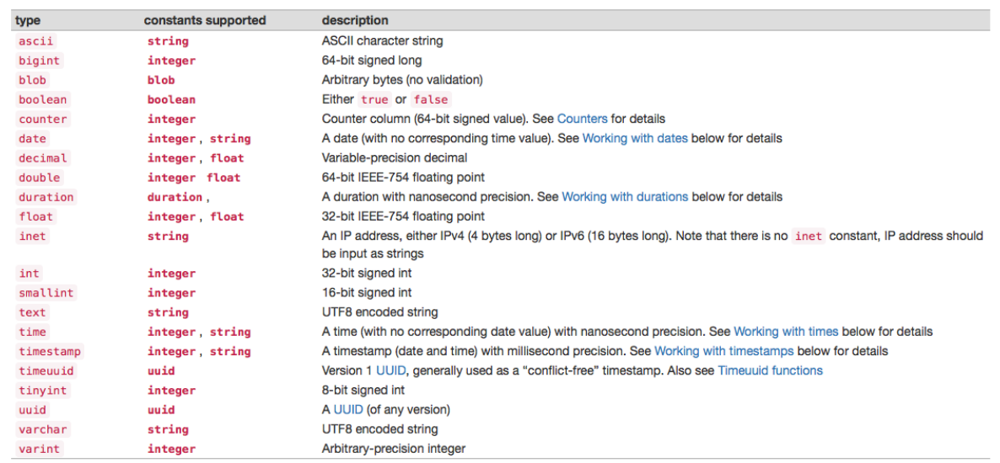

# CBD | Prática 3 | Cassandra

Gonçalo Matos, 92972


A Cassandra é uma <u>base de dados orientada a colunas</u> desenvolvida em código aberto (em Java)

> Documentação [aqui](https://cassandra.apache.org/doc/latest/cql/) e [aqui](https://docs.datastax.com/en/dse/6.8/cql/)
>
> Recursos úteis em [learning.oreilly.com](https://learning.oreilly.com/playlists/746f36eb-60f8-4884-abbc-ef36b9305dc5/)


## Instalação local

> [Download](https://cassandra.apache.org/)


### Erros na instalação

Erros obtidos na execução da Cassandra, após a instalação:

- `Improperly specified VM option 'ThreadPriorityPolicy=42'`

  - Depois de pesquisar por uma solução, houve quem sugerisse comentar esta linha no ficheiro `conf/jvm.options`, o que deu origem a vários erros. 
  - Acabei por conseguir correr a aplicação, utilizando o JAVA 8. Para tal, criei um *script* que atualiza as variáveis de ambiente do JAVA.

  ```bash
  export JAVA_HOME=/usr/lib/jvm/java-8-openjdk
  export JRE_HOME=/usr/lib/jvm/java-8-openjdk/jre
  export PATH=$PATH:$JAVA_HOME/bin:$JRE_HOME/bin
  ```

- Erros de permissões para o acesso a pastas do programa.

  - Encontrei solução [aqui](https://support.datastax.com/hc/en-us/articles/360014434777-ERROR-Doesn-t-have-write-permissions-for-directory).

  - Concluí que o utilizador que estava a executar era o meu, por isso alterei as permissões das pastas para o meu username.

    ```bash
    $ sudo chown -R goncalo /var/lib/cassandra/data/data
    ```

  


### Como executar

Para executar a Cassandra, devem ser atualizadas as variáveis de ambiente e depois executado o seu comando.

```bash
$ source ./updateJavaVars.sh
$ cassandra -f
```


### Cliente

```bash
$ cqlsh
```


## Modelo de dados



Uma **família de colunas** caracteriza-se por um <u>mapa multidimensional indexado por uma chave</u>.

```java
Map<RowKey, SortedMap<ColumnKey, ColumnValue>>
```

As **linhas** são conjuntos de colunas identificadas por uma <u>chave primária</u>. As linhas da mesma tabela não têm de ter as mesmas colunas.

As **colunas** são pares chave/valor. Os seus valores podem ser nulos, <u>atómicos</u> na forma de tipos de dados primitivos, tuplos ou UDT (*user defined types*) ou <u>coleções</u> através de *sets*, listas e mapas.


Cada tipo de dado atómico pode ter a si associado dados adicionais, como o **Time-To-Live (TTL)**, que define o período do tempo durante os dados são acessíveis, após o qual são eliminados e ainda o **Timestamp**, que define o momento da escrita.


### Tipos de dados

> **ATENÇÃO** Os tipos de dado `ascii` são escritos entre <u>pelicas</u>!




#### Coleções

> [Definição](https://docs.datastax.com/en/archived/cql/3.1/cql/cql_reference/collection_type_r.html)
>
> Manipulação de [Sets](https://docs.datastax.com/en/cql-oss/3.3/cql/cql_using/useInsertSet.html), [Listas](https://docs.datastax.com/en/cql-oss/3.3/cql/cql_using/useInsertList.html) e [Mapas](https://docs.datastax.com/en/cql-oss/3.3/cql/cql_using/useInsertMap.html)

É também possível utilizar coleções. 

##### Definição

```cassandra
CREATE TABLE tableName(
	myset set<ascii>,
    mylist list<int>,
    mymap map<ascii, double>
)
```

As listas são representadas por parêntesis retos e os mapas e dicionários por chavetas.

```cassandra
INSERT INTO tableName (myset, mylist, mymap) VALUES ({'a', 'b', 'c'}, [1, 2, 3], {'a': 1, 'b': 2})

INSERT INTO tableName JSON '{ "myset": ["a", "b", "c"], "mylist": [1, 2, 3]: "mymap": { "a": 1, "b": 2 } }'
```

##### Atualização

A sua manipulação é bastante simples, sendo possível em todas as estruturas de dados fazer *append* ou eliminação de elementos através das operações de soma e subtração.

```cassandra
UPDATE tableName SET myset = myset + {'d'} WHERE ...;
UPDATE tableName SET mylist = mylist + [4] WHERE ...;
UPDATE tableName SET mymap = mymap + {'d': 4} WHERE ...;

UPDATE tableName SET myset = myset - {'d'} WHERE ...;
// O mesmo para as restantes
```

As listas permitem ainda a atualização de índices.

> Apenas é possível atualizar índices existentes!

```cassandra
UPDATE tableName SET mylist[0] = 99 WHERE ...;
```

Os dicionários permitem de forma análoga a atualização, mas também a definição de pares chave/valor.

```cassandra
UPDATE tableName SET mymap['a'] = 99 WHERE ...; // Atualização, porque chave 'a' já existia
UPDATE tableName SET mymap['z'] = 99 WHERE ...; // Definição, porque chave 'z' ainda não existia
```

##### Eliminação

Para eliminar um atributo do tipo coleção segue-se o mesmo procedimento que para qualquer outro atributo.

```cassandra
DELETE myset FROM tableName WHERE ...;
```

 Nas listas e nos dicionários é ainda possível eliminar itens em determinados índices e com determinadas chaves, respetivamente.

```cassandra
DELETE mylist[0] FROM tableName WHERE ...;
DELETE mymap['a'] FROM tableName WHERE ...;
```


#### Estruturas de dados definidas pelo utilizador

Podem ainda ser definidas estruturas de dados pelo utilizador. [Ver mais](https://docs.datastax.com/en/archived/cql/3.1/cql/cql_using/cqlUseUDT.html#cqlUseUDT)


## CQLSH

A **Cassandra Query Language Shell** permite interagir com este sistema de base de dados através da linha de comandos. A sua sintaxe é bastante semelhante à do SQL e tal como este define comandos para a definição (DDL) e manipulação (DML) de dados.


### DDL

> [Documentação](https://cassandra.apache.org/doc/latest/cql/ddl.html)

#### Keyspace

A criação do keyspace implica a definição da opção `replication`.

```cassandra
CREATE KEYSPACE [ IF NOT EXISTS ] <keyspaceName> WITH <options>
```

> As opções suportadas são:
>
> `replication` Objeto JSON. A estratégia de replicação a utilizar, definida através do atributo `class`.
>
> > Existem duas estratégias possíveis:
> >
> > `SimpleStrategy` para soluções locais. Deve ainda ser definido o `replication_factor`, que define o número de réplicas a armazenar.
> >
> > `NetworkTopologyStrategy` para soluções distribuídas em rede. Deve ser definido um atributo por cada *datacenter* com o seu nome ao qual se faz corresponder o valor do número de réplicas a armazenar.
>
> `durable_writes` Por defeito a *true*. Define a utilização de *commit logs* para atualizações.
>
> ```cassandra
> replication = {'class': 'SimpleStrategy', 'replication_factor' : 3} AND durable_writes = false
> ```

Existem ainda outras operações associadas à sua gestão.

```cassandra
USE <keyspace_name>

DROP KEYSPACE [ IF EXISTS ] <keyspace_name>

ALTER KEYSPACE <keyspace_name> WITH <options>
```


#### Table

Uma vez que as bases de dados orientadas a colunas são orientadas aos serviços, a estrutura da tabela deve ser feita depois de definidas as consultas que são necessárias fazer sobre ela.

```cassandra
CREATE TABLE [ IF NOT EXISTS ] table_name
	'('
		column_definition ( ',' column_definition )*
		[ ',' PRIMARY KEY '(' primary_key ')' ]
	')' [ WITH table_options ]
 
column_definition      ::=  column_name cql_type [ STATIC ] [ PRIMARY KEY]
table_options          ::=  CLUSTERING ORDER BY '(' clustering_order ')' [ AND options ]
                            | options
clustering_order       ::=  column_name (ASC | DESC) ( ',' column_name (ASC | DESC) )*
```

A chave primária é composta por duas partes:

- A **partition key**, que pode ter uma ou várias colunas e define a <u>distribuição das linhas da tabela pelas várias partições</u>;

- As **clustering columns**, opcionais, que definem a <u>ordem pela qual as linhas são agrupadas em cada partição</u>.

> Para inverter a ordem das **clustering columns** usar `CLUSTERING ORDER BY`.


**ATENÇÃO!** A junção destas duas partes (partition + clustering) para cada linha deve ser única, <u>havendo *overwrite* de dados que sejam escritos com a mesma Primary Key</u>!


```cassandra
primary_key            ::=  partition_key [ ',' clustering_columns ]
partition_key          ::=  column_name | '(' column_name ( ',' column_name )* ')'
clustering_columns     ::=  column_name ( ',' column_name )*
```

```cassandra
// Clustering key para tabela com colunas cluster, date, datacenter, hour, minute, numberOfRequests
PRIMARY KEY ((cluster, date), datacenter, hour, minute)

// A estrutura interna de cada partição será
// { datacenter: 
// 		PT_Aveiro 
// 		{ 
//			hour: 
// 				0 { minute: 0 { numberOfRequests: 130 } } ... { minute: 59 ... } 
// 		} 
// 		...
//		{
//			hour:
//				23 ...
//		}
// }
```


Existem ainda outras operações associadas à sua gestão.

```cassandra
DROP TABLE [ IF EXISTS ] table_name

TRUNCATE [ TABLE ] table_name
// Removes all table content but not the table itself

ALTER TABLE table_name alter_table_instruction
alter_table_instruction ::=  ADD column_name cql_type ( ',' column_name cql_type )*
                             | DROP column_name ( column_name )*
                             | WITH options                
```


### DML | Queries CRUD

> [Documentação](https://cassandra.apache.org/doc/latest/cql/dml.html)


#### Read

Não são suportadas junções!

```cassandra
SELECT [ JSON | DISTINCT ] ( select_clause | '*' )
                      FROM table_name
                      [ WHERE where_clause ]
                      [ GROUP BY group_by_clause ]
                      [ ORDER BY ordering_clause ]
                      [ PER PARTITION LIMIT (integer | bind_marker) ]
                      [ LIMIT (integer | bind_marker) ]
                      [ ALLOW FILTERING ]
                      
select_clause    ::=  selector [ AS identifier ] ( ',' selector [ AS identifier ] )
selector         ::=  column_name
                      | term
                      | CAST '(' selector AS cql_type ')'
                      | function_name '(' [ selector ( ',' selector )* ] ')'
                      | COUNT '(' '*' ')'
relation         ::=  column_name operator term
                      '(' column_name ( ',' column_name )* ')' operator tuple_literal
                      TOKEN '(' column_name ( ',' column_name )* ')' operator term
operator         ::=  '=' | '<' | '>' | '<=' | '>=' | '!=' | IN | CONTAINS | CONTAINS KEY
```

Como `selector`, podem ser utilizadas para além do nome das colunas, [funções definidas pelo utilizador](#User Defined Functions), ou as disponibilizadas de raiz. Assim como funções de agregação.

| Função de seleção   |                                             |
| ------------------- | ------------------------------------------- |
| `WRITETIME(<attr>)` | Timestamp do momento da escrita do atributo |
| `TTL(<attr>)`       | Time to live do atributo                    |

| Função de agregação         |      |
| --------------------------- | ---- |
| `MIN(<attr>)`/`MAX(<attr>)` |      |
| `COUNT(<attr>)`             |      |
| `SUM(<attr>)`               |      |
| `AVG(<attr>)`               |      |


##### Where clause

```cassandra
where_clause     ::=  relation ( AND relation )*
```

As relações da `where_clause` devem ser escritas cuidadosamente, tendo em atenção que **é obrigatório o uso de todas as colunas de um dos índices** (chave primária ou outro) e que <u>esta relação só pode utilizar as operações **=** e **IN**</u>.

> Não pode ser utilizada comparação na chave primária porque estas são distribuídas por uma função de *hash* e por isso não há noção de ordem.

Podem ainda ser opcionalmente adicionadas relações com as **clustering columns**, que já suportam um leque maior de operações. No entanto, a aparecerem, <u>têm de aparecer na mesma sequência em que são declarados, sem omitir nenhum dos anteriores</u> (seguintes podem ser omitidos)!

- =, <, <=, >=, >

> <u>Estas operações só podem ser realizadas na última coluna a ser restringida</u>, uma vez que vai retornar várias linhas, sobre as quais teriam de ser feitos *queries* individuais caso houvesse uma operação seguinte do mesmo género, o que vai contra os princípios de simplicidade, rapidez e eficiência das bases de dados orientadas a colunas.
>
> ```cassandra
> AND hour=12 AND minute<=15 //OK
> AND hour=12 AND minute<=15 AND minute>=10 //OK
> AND hour<=12 AND minute<=15 //ERROR
> ```
>
> <u>Estas operações podem ainda ser realizadas sobre conjuntos de colunas</u>, mas neste caso, caso haja mais do que uma operação, esta deve ser realizada sobre todas as colunas, ou parte delas, mas sempre em sequência a partir da primeira (só podem ser retiradas colunas do fim da sequência, nunca do início!).
>
> ```cassandra
> ... AND (hour, minute) >= (12, 35) AND (hour) <= 16 //OK
> ... AND (hour, minute) >= (12, 35) AND (minute) <= 40 //ERRORR
> ```

- IN
- CONTAINS, CONTAINS KEY

> A `CONTAINS` é utilizada em coleções de forma geral. A `CONTAINS KEY` apenas em mapas.


##### Group(ing) results

```cassandra
group_by_clause  ::=  column_name ( ',' column_name )*
```

Permite o agrupamento das linhas da tabela de acordo com determinadas colunas. Este agrupamento <u>só pode ser induzido por colunas da chave primária (total ou parcial) na ordem em que são declarados</u>.

> Se alguma destas colunas estiver definida como restrição de igualdade numa das relações do `where`, a sua inclusão nesta cláusula passa a ser facultativa.

Se numa destas cláusulas for selecionada uma coluna sem função de agregação, o valor retornado será o primeiro encontrado dentro do grupo de resultados.

> Por exemplo se fizermos uma agregação de alunos por curso, sendo a única chave de agregação o curso, como vão haver vários alunos por cada curso, só vai ser mostrado o primeiro.

```cassandra
SELECT * FROM contacts WHERE type='personal' GROUP BY type
// Sendo type a chave primária e a totalidade da partition key
```


##### Orde(r)nar resultados

```cassandra
ordering_clause  ::=  column_name [ ASC | DESC ] ( ',' column_name [ ASC | DESC ] )*
```

Apenas é possível fazer ordenações induzidas pelas **clustering columns**.


##### (Limit)ar  resultados

```cassandra
LIMIT (integer | bind_marker)
```


##### Allow filtering

```cassandra
ALLOW FILTERING
```

Como visto anteriormente, por defeito a Cassandra bloqueia a execução de *queries* que envolvam filtração por colunas que não a chave primária, uma vez que estes *queries* requerem uma <u>complexidade temporal proporcional à quantidade de dados retornada por eles</u> .

No entanto, ao introduzir esta opção no *query* de pesquisa, estamos a permitir explicitamente a execução destas operações de filtragem.


#### Insert

```cassandra
INSERT INTO table_name ( names_values | json_clause )
	[ IF NOT EXISTS ]
	[ USING update_parameter ( AND update_parameter )* ]

names_values     ::=  names VALUES tuple_literal
json_clause      ::=  JSON string [ DEFAULT ( NULL | UNSET ) ]
names            ::=  '(' column_name ( ',' column_name )* ')'
update_parameter ::=  ( TIMESTAMP | TTL ) ( integer | bind_marker )

// INSERT INTO NerdMovies JSON '{"movie": "Serenity", "director": "Joss Whedon", "year": 2005}';
// INSERT INTO NerdMovies (movie, director, main_actor, year) VALUES ('Serenity', 'Joss Whedon', 'Nathan Fillion', 2005)
```

Escreve uma ou mais colunas para uma determinada linha. 

<u>Têm de ser especificadas pelo menos as colunas da chave primária</u>.


#### Update

```cassandra
update_statement ::=  UPDATE table_name
	[ USING update_parameter ( AND update_parameter )* ]
	SET assignment ( ',' assignment )*
	WHERE where_clause
	[ IF ( EXISTS | condition ( AND condition )*) ]
                      
update_parameter ::=  ( TIMESTAMP | TTL ) ( integer | bind_marker )
assignment       ::=  simple_selection '=' term
                     | column_name '=' column_name ( '+' | '-' ) term
                     | column_name '=' list_literal '+' column_name
simple_selection ::=  column_name
                     | column_name '[' term ']'
                     | column_name '.' `field_name
condition        ::=  simple_selection operator term
```

A cláusula `WHERE` tem de conter <u>todas as colunas da chave primária</u>!

Ao contrário do SQL, <u>esta operação não verifica se a linha correspondente existia anteriormente</u>, pelo que se for feita uma atualização sobre uma linha com uma chave primária que não corresponda a nenhuma, será criada uma nova linha com esses dados.


##### Parâmetros de atualização

| Parâmetro   |                                                              |
| ----------- | ------------------------------------------------------------ |
| `TTL`       | Tempo de vida dos registos inseridos <u>em segundos</u>.<br>0, null ou omisso para dados persistentes. |
| `TIMESTAMP` | Momento da operação.<br>Se não for definido, é definido o momento atual por defeito em micro segundos. |


#### Delete

```cassandra
DELETE [ simple_selection ( ',' simple_selection ) ]
FROM table_name
[ USING update_parameter ( AND update_parameter )* ]
WHERE where_clause
[ IF ( EXISTS | condition ( AND condition )*) ]
```

> Para eliminar todas as linhas da tabela.
>
> ```cassandra
> TRUNCATE [ TABLE ] table_name
> ```


### Índices secundários

A única forma de conseguir selecionar dados com base em colunas que não façam parte da chave primária é a criação de índices.

```cassandra
create_index_statement ::=  CREATE [ CUSTOM ] INDEX [ IF NOT EXISTS ] [ index_name ]
                                ON table_name '(' index_identifier ')'
                                [ USING string [ WITH OPTIONS = map_literal ] ]
index_identifier       ::=  column_name
                           | ( KEYS | VALUES | ENTRIES | FULL ) '(' column_name ')'
                           
// CREATE INDEX userIndex ON NerdMovies (user);
```


### User Defined Functions

Por defeito a Cassandra suporta que estas funções sejam escritas em Java ou Javascript.

```cassandra
CREATE [OR REPLACE] FUNCTION some_function ( <argname> int )
    RETURNS NULL ON NULL INPUT
    RETURNS int
    LANGUAGE java
    AS $$ <javaCode> $$;
    
DROP FUNCTION [ IF EXISTS ] function_name
```


### User Defined Aggregates

Estas funções atuam sobre um conjunto de linhas. <u>Recebem valores para cada linha e retornam um valor para todo o conjunto</u>.

```cassandra
CREATE [ OR REPLACE ] AGGREGATE [ IF NOT EXISTS ]
	function_name '(' arguments_signature ')'
	SFUNC function_name
    STYPE cql_type
	[ FINALFUNC function_name ]
	[ INITCOND term ]
```

Para tal, definem um estado inicial através do `INITCOND`, do tipo `STYPE`.

A cada iteração é chamada a função do estado, `SFUNC`. Esta função recebe como argumentos o estado atualizado e os valores das colunas definidas pelo utilizador para a agregação. O seu valor de retorno é assumido como o novo estado. 

No final de todas as linhas serem processadas, é chamada a função `FINALFUNC`, recebendo como argumento o estado atualizado.

> Ver exemplo [aqui](https://cassandra.apache.org/doc/latest/cql/functions.html#aggregate-functions)


## Driver Java

> [Driver](https://github.com/datastax/java-driver), [Tutorial](https://www.baeldung.com/cassandra-datastax-java-driver) e [Doc](https://docs.datastax.com/en/drivers/java/4.9/)
>
> [Documentação Query Builder](https://docs.datastax.com/en/developer/java-driver/4.3/manual/query_builder/)


